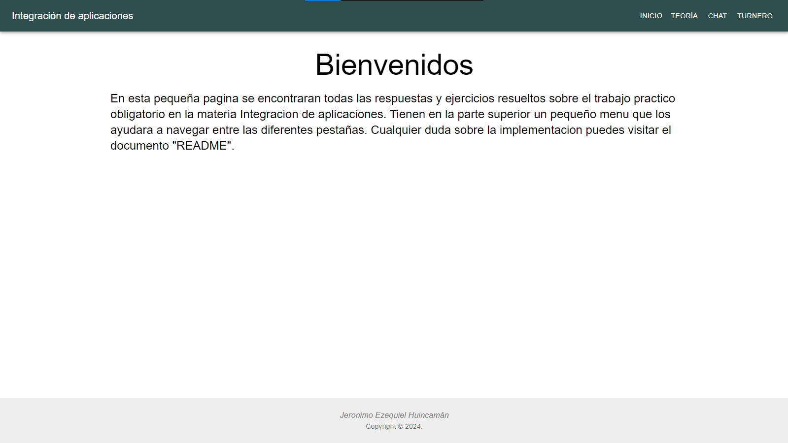
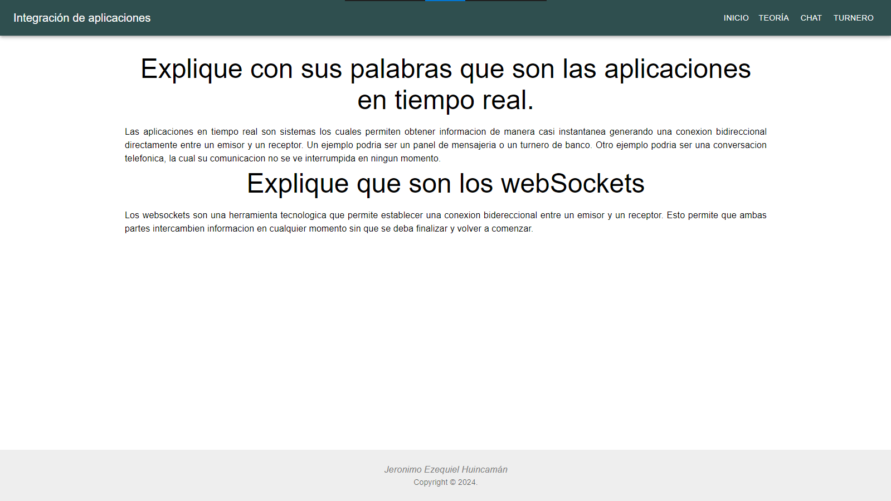
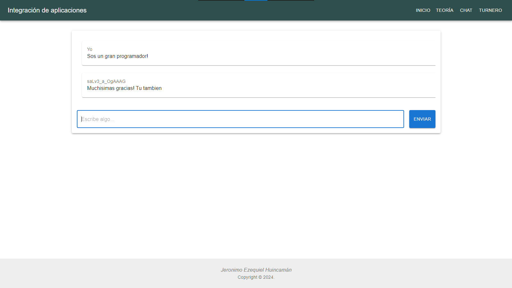
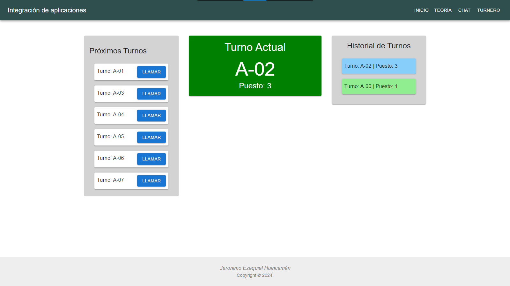

# Chat + Turnero
## Integracion de aplicaciones

## Ejemplos





## Guia para poder utilizar el sistema
```bash
    git clone https://github.com/jeronimohuincaman/pbackend_websocket_turnero.git
```
```bash
    cd pbackend_websocket_turnero
    npm install
```
```bash
    cd frontend
    npm install
    cd ..
```
```bash
    npm run start:back
```
#### En nueva terminal
```bash
    npm run start:front
    h + enter
    o + enter
```

### Posibles errores
1. Si se quiere conectar con varios clientes al 'turnero' o al 'chat' se debe refrescar la pagina en ambas pestañas al mismo tiempo para tener una sincronizacion de los datos.
2. Cuando se navega de diferentes pestañas al 'turnero' se debe refrescar la pestaña para que carguen los turnos.
